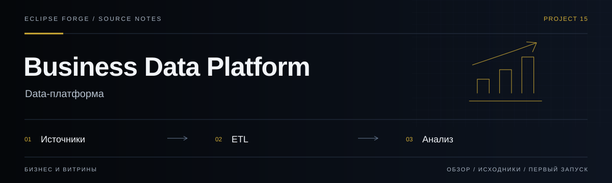

# Business Data Platform



**Data-платформа.** Прототип анализа компаний и наблюдения за ETL-процессами с отдельными backend и frontend.

<!-- repository-guide:start -->
[Первый запуск](#readme-start) · [Что внутри](#readme-map) · [Путеводитель](docs/repository-guide.md#start) · [Карта кода](docs/repository-guide.md#map) · [Проверки](docs/repository-guide.md#checks) · [Границы и права](docs/repository-guide.md#boundaries)

<a id="readme-map"></a>

## Проект за минуту

- **[Backend и ETL](<backend/python_app>)** — Сервисная часть и обработка данных компаний.
- **[Аналитический интерфейс](<frontend/business-analysis-service>)** — Отдельное клиентское приложение анализа компаний.
- **[Наблюдаемость](<monitoring>)** — Конфигурации метрик, журналов и дашбордов.

<a id="readme-start"></a>

## Начать локально

**Среда:** Node.js и npm. **Источник:** [frontend/business-analysis-service/package.json](<frontend/business-analysis-service/package.json>).

Из корня клонированного репозитория:

```bash
cd frontend/business-analysis-service
npm ci
npm run dev
```

Это только Next.js frontend. Docker/ETL и мониторинг — отдельные процессы; не запускайте планировщик ради просмотра интерфейса.

<details>
<summary><strong>Перед первым запуском и изменением кода</strong></summary>

- Команды сверены с исходниками 8 сентября 2026. Это инструкция, а не отметка об успешном запуске или текущем production.
- Установка зависимостей может обращаться в registry и выполнять lifecycle scripts. Используйте отдельную рабочую среду и демонстрационные данные.
- Данные компаний и права доступа оцениваются отдельно; demo-данные не следует смешивать с выгрузками реальных клиентов.


</details>
<!-- repository-guide:end -->

## 🚀 Quick Start

```bash
make init
make etl-up
```

## 📁 Project Structure

```
├── backend/          # FastAPI backend
│   └── python_app/
│       └── etl_project/  # ETL парсинг с cron
├── frontend/         # Next.js frontend  
├── monitoring/       # Prometheus, Grafana, Loki
├── scripts/          # Utility scripts
└── docker-compose.yml
```

## 🔧 Development

```bash
make dev          # Start development environment
make logs         # View all logs
make test         # Run tests
make clean        # Clean up containers
```

## 🕐 ETL Парсинг

### Основные команды:
```bash
make etl-build    # Сборка ETL контейнера
make etl-up       # Запуск ETL планировщика
make etl-logs     # Логи ETL процессов
make etl-run      # Ручной запуск ETL
make etl-health   # Проверка здоровья ETL
make etl-status   # Статус ETL сервиса
```

### Нагрузочное тестирование:
```bash
make load-test-generate  # Генерация тестовых данных (200 компаний)
make load-test-run       # Запуск симуляции нагрузки
make load-test-report    # Генерация отчета производительности
make load-test-full      # Полный цикл тестирования
```

### Расписание cron:
- **Каждый час в 5 минут** - загрузка данных ФНС
- **Каждый день в 2:00** - полная синхронизация
- **Каждые 30 минут** - проверка здоровья ETL
- **Каждые 15 минут** - мониторинг API

### Мониторинг ETL:
```bash
make monitoring   # Запуск мониторинга
```

**Grafana**: http://your_server_ip:3002 (admin/your_grafana_password)
- Дашборд "ETL Monitoring" - статус парсинга
- Дашборд "ETL Performance" - метрики производительности
- Логи ETL: `{service="etl"}`

**Loki Queries**:
```logql
{service="etl"} | json
{service="etl", level="ERROR"}
{service="etl", event_type="etl_job_complete"}
{service="etl", event_type="etl_load_test_complete"}
```

**Prometheus Metrics**:
- ETL метрики: http://your_server_ip:8002/metrics
- Производительность: `etl_companies_processed_total`
- Ресурсы: `etl_memory_usage_bytes`, `etl_cpu_usage_percent`

## 📊 Мониторинг

- **Grafana**: http://your_server_ip:3002 (admin/your_grafana_password)
- **Prometheus**: http://your_server_ip:9090
- **Loki**: http://your_server_ip:3100
- **Alertmanager**: http://your_server_ip:9093

## 🚨 Алерты

### ETL Алерты:
- `ETLJobFailed` - ошибка в ETL процессе
- `ETLNoActivity` - нет активности 2+ часа
- `FNSAPIErrors` - ошибки API ФНС
- `FNSAPIForbidden` - блокировка API ключа

### Telegram уведомления:
Настройте в `.env`:
```env
TELEGRAM_BOT_TOKEN=your_telegram_bot_token
TELEGRAM_CHAT_ID=your_chat_id
TELEGRAM_ALERTS_ENABLED=true
```

## 🔄 CI/CD

Автоматический деплой ETL:
- **Расписание**: каждый день в 2:00 UTC
- **Ручной запуск**: GitHub Actions → "ETL CI/CD Pipeline"
- **Health Check**: автоматическая проверка после деплоя

## 🛠️ Environment Variables

Create `.env` file with:

```env
POSTGRES_DB=myapp_dev
POSTGRES_USER=devuser
POSTGRES_PASSWORD=devpass
FNS_API_KEY=your_api_key
TELEGRAM_BOT_TOKEN=your_telegram_bot_token
TELEGRAM_CHAT_ID=your_chat_id
TELEGRAM_ALERTS_ENABLED=true

NEXT_PUBLIC_API_BASE_URL=http://your_server_ip:8000
GF_SERVER_ROOT_URL=http://your_server_ip:3002
GF_SECURITY_ADMIN_PASSWORD=your_grafana_password
```

## 📝 License

MIT
